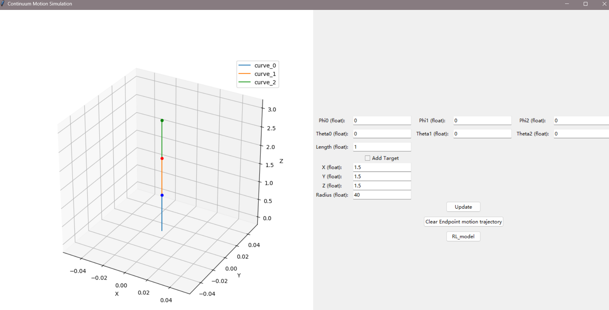

# ContinuumRobotMotionSimulation

## Background

Soft robots face significant challenges in accurate analytical modeling due to nonlinear deformations caused by actuation, and sensitivity to environmental contact.

With the advancement of artificial intelligence, kinematics + RL methods provide attractive ways to handle complex situations and complete complex tasks that may be limited by traditional control strategies.

## Introduction to the code repository

**plotAPP.py**
- Visual application, use tkinter framework, just run it directly.
- 

**Kinematics**
- Store the codes for forward kinematics calculations.

**model_libs**
- Store all deep learning models.

**reinforcement_learning**
- Store all reinforcement learning codes, to be continued...

## Contributions

1. Modeling a three-segment continuum using kinematic frameworks;

2. Trained the RL model based on the actor-critic model(to be continued);

3. Control the robot using the model to move from the starting point to the target point;

4. Made a graphical interface to display the motions.

